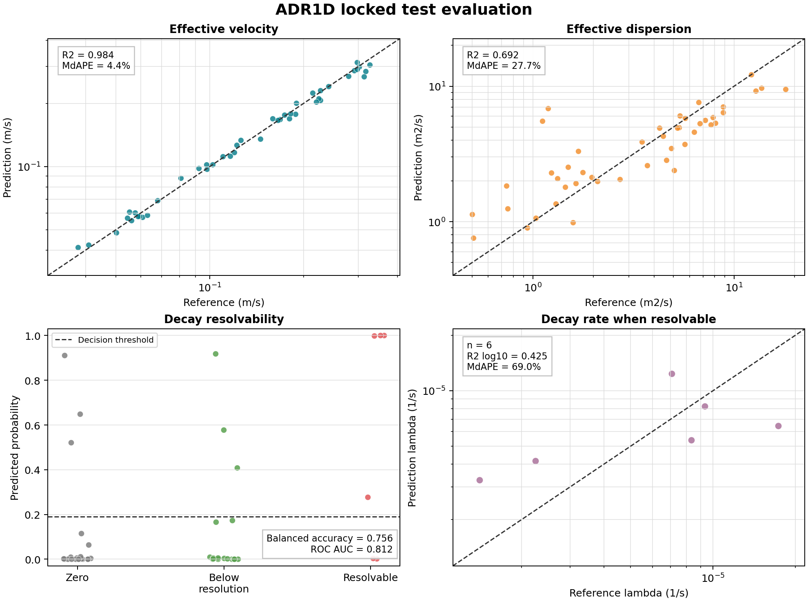
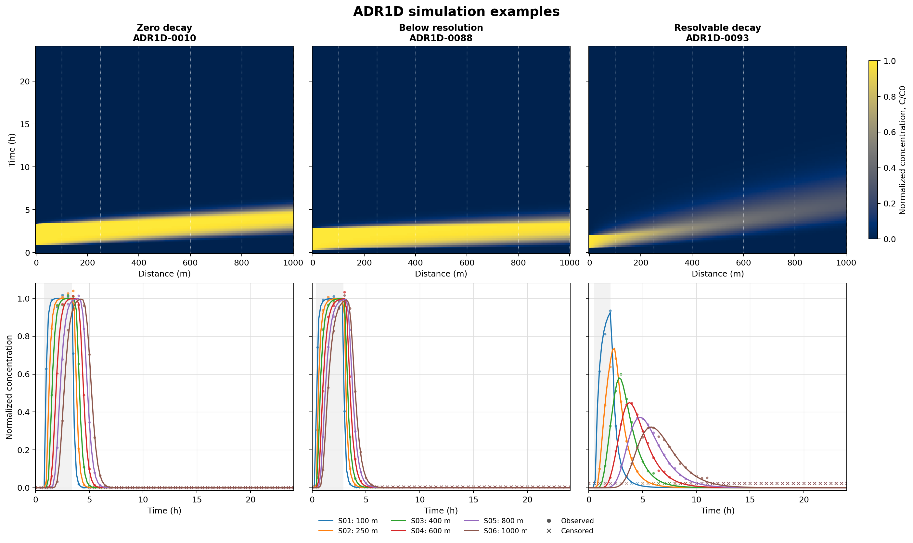
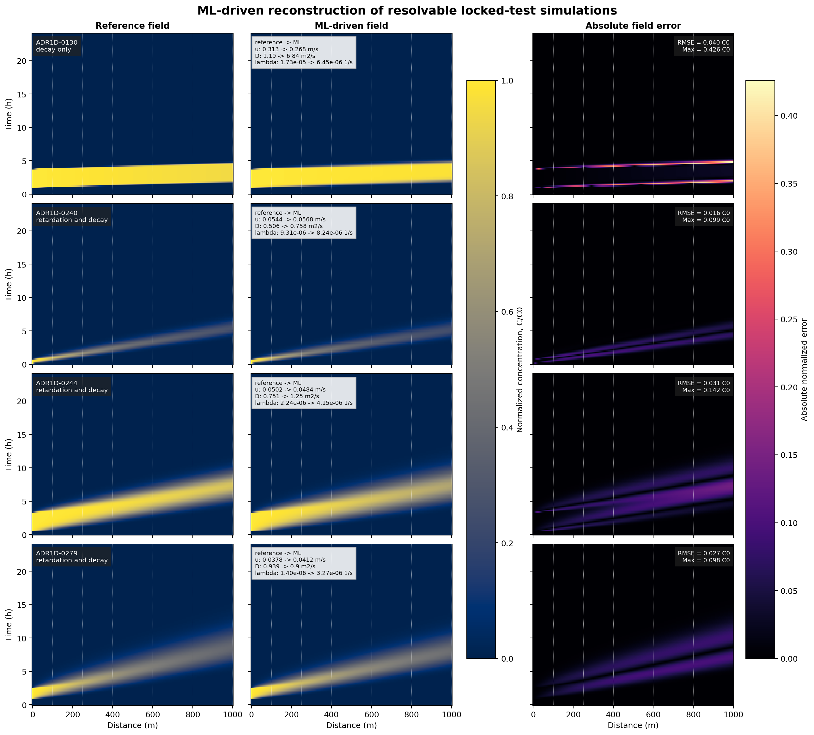

# ADR1D-ML :droplet:

<div align="center">

[](https://github.com/gstinoco/ADR1D-ML) [](https://www.python.org/) [](https://scikit-learn.org/) [](#gear-model-components) [](#white_check_mark-validation--reproducibility) [](LICENSE) [](LICENSE-DATA)

**Machine-learning inference of identifiable transport parameters from six-sensor ADR1D concentration histories.**

*A locked, reproducible model bundle for effective velocity, effective dispersion, and sensor-resolvable first-order decay.*

### :link: Quick Links

[](#rocket-quick-start) [](#inbox_tray-input-contract) [](#gear-model-components) [](#bar_chart-locked-test-results) [](#ocean-simulation-results) [](#arrows_counterclockwise-numerical-integration) [](#memo-how-to-cite) [](#scientist-research-team) [](#factory-industry-partners-supporting-innovation) [](#email-contact--support)

</div>

---

## :clipboard: Table of Contents

- [Overview](#star2-overview)
- [Repository Structure](#open_file_folder-repository-structure)
- [Installation](#package-installation)
- [Quick Start](#rocket-quick-start)
- [Input Contract](#inbox_tray-input-contract)
- [Prediction Contract](#outbox_tray-prediction-contract)
- [Scientific Formulation](#books-scientific-formulation)
- [Model Components](#gear-model-components)
- [Training Protocol](#twisted_rightwards_arrows-training-protocol)
- [Locked Test Results](#bar_chart-locked-test-results)
- [Simulation Results](#ocean-simulation-results)
- [Numerical Integration](#arrows_counterclockwise-numerical-integration)
- [Validation and Reproducibility](#white_check_mark-validation--reproducibility)
- [Data Provenance](#mag-data-provenance)
- [File Integrity](#lock-file-integrity)
- [Limitations](#warning-limitations--responsible-use)
- [How to Cite](#memo-how-to-cite)
- [Research Team](#scientist-research-team)
- [Industry Partners](#factory-industry-partners-supporting-innovation)
- [License and Rights](#page_facing_up-license--rights)
- [Acknowledgments](#pray-acknowledgments)
- [Contact and Support](#email-contact--support)
- [FAQ](#speech_balloon-faq)

---

## :star2: Overview

ADR1D-ML is an initial machine-learning model for inverse estimation of
transport parameters from noisy concentration histories. It was developed from
the public [ADR1D benchmark](https://github.com/gstinoco/ADR1D), which provides
300 analytical one-dimensional advection-dispersion-reaction scenarios with
fixed train, validation, and test partitions.

The repository distributes:

- a serialized bundle containing four scikit-learn pipelines;
- a feature extractor for raw six-sensor ADR1D-format observations;
- a command-line inference interface that does not require target labels;
- the locked training protocol and final evaluation artifacts;
- the two compact modeling tables needed to reproduce training;
- exact dependency versions, integrity metadata, licenses, and technical notes.

### :wrench: What the model estimates

| Output | Symbol | Unit | Interpretation |
|---|---:|---:|---|
| Effective velocity | $u_{eff}=v/R$ | m s<sup>-1</sup> | Advective coefficient in the normalized ADR equation |
| Effective dispersion | $D_{eff}=D/R$ | m<sup>2</sup> s<sup>-1</sup> | Dispersive coefficient in the normalized ADR equation |
| Decay resolvability | $P(\mathrm{resolvable})$ | dimensionless | Probability that decay exceeds the modeled sensor resolution |
| Conditional decay rate | $\lambda$ | s<sup>-1</sup> | Reported only when decay is classified as resolvable |

The model does **not** recover $v$, $D$, and $R$ separately from concentration
alone. That distinction is a property of the governing equation, not a choice
of machine-learning architecture.

### :bar_chart: Release at a Glance

| Item | Value |
|---|---:|
| ADR1D scenarios | 300 |
| Training / validation / test | 210 / 45 / 45 |
| Sensor locations | 6 |
| Time samples per sensor | 49 |
| Base features | 69 |
| Physics-derived features | 17 |
| Development scenarios used for final fitting | 255 |
| Locked test scenarios | 45 |
| Bundle version | 1.0.0 |
| Random seed | 20260720 |

---

## :open_file_folder: Repository Structure

```text
.
|-- README.md
|-- CITATION.cff
|-- LICENSE
|-- LICENSE-DATA
|-- requirements.txt
|-- data/
|   |-- adr1d_modeling_table.csv
|   |-- adr1d_decay_detectability_table.csv
|   |-- example_sources.csv
|   |-- example_sensor_observations.csv
|   `-- example_features.csv
|-- models/
|   |-- adr1d_parameter_models.joblib
|   `-- model_manifest.json
|-- scripts/
|   |-- __init__.py
|   |-- extract_sensor_features.py
|   |-- predict_parameters.py
|   |-- train_and_evaluate_final_models.py
|   |-- validate_final_models.py
|   |-- validate_release.py
|   |-- plot_final_test_results.py
|   `-- plot_simulation_results.py
|-- results/
|   |-- final_model_protocol.json
|   |-- final_test_metrics.json
|   |-- final_test_predictions.csv
|   |-- final_model_validation.json
|   |-- baseline_validation_summary.json
|   |-- decay_detectability_validation_summary.json
|   |-- example_predictions.csv
|   `-- simulation_reconstruction_metrics.csv
`-- docs/
    |-- final_test_diagnostics.png
    |-- simulation_examples.png
    |-- simulation_reconstructions.png
    `-- team/
```

The repository is self-contained for inference, locked-model validation, and
retraining. The larger ADR1D analytical field and raw sensor release remain in
the upstream data repository to avoid unnecessary duplication.

---

## :package: Installation

### System requirements

| Component | Supported configuration |
|---|---|
| Python | 3.12 |
| Operating system | Linux, macOS, or Windows |
| RAM | 2 GB minimum; 4 GB recommended for retraining |
| Storage | Approximately 20 MB plus the virtual environment |

### Clone and install

```bash
git clone https://github.com/gstinoco/ADR1D-ML.git
cd ADR1D-ML

python3 -m venv .venv
source .venv/bin/activate  # Windows PowerShell: .venv\Scripts\Activate.ps1
python -m pip install --upgrade pip
python -m pip install -r requirements.txt
```

Exact versions are pinned because scikit-learn's Joblib persistence format is
not guaranteed to remain compatible across library versions.

### Installation check

```bash
python scripts/validate_final_models.py
python scripts/validate_release.py
```

A successful check ends with:

```json
{
  "model_bundle_loaded": true,
  "reproduced_prediction_arrays": 5,
  "recomputed_metric_checks": 4,
  "status": "ok",
  "test_rows": 45
}
```

The second command independently exercises the complete public path from raw
sensor CSV files through feature extraction and in-memory parameter inference.

---

## :rocket: Quick Start

### Run the bundled feature example

```bash
python scripts/predict_parameters.py \
  --input-csv data/example_features.csv \
  --output-csv results/my_predictions.csv
```

This path is appropriate when the 86 input features have already been
calculated.

### Use the in-memory Python interface

```python
import pandas as pd

from scripts.predict_parameters import load_verified_bundle, predict_feature_table

features = pd.read_csv("data/example_features.csv")
bundle, manifest = load_verified_bundle()
parameters = predict_feature_table(features, bundle)
```

`parameters` can be passed directly to a numerical workflow. The loader checks
the model against its manifest before deserialization.

### Start from sensor observations

```bash
python scripts/extract_sensor_features.py \
  --sources-csv data/example_sources.csv \
  --observations-csv data/example_sensor_observations.csv \
  --output-csv results/my_features.csv

python scripts/predict_parameters.py \
  --input-csv results/my_features.csv \
  --output-csv results/my_predictions.csv
```

The included example contains three validation scenarios representing zero,
below-resolution, and resolvable decay. Target parameters are deliberately
absent from the example input files.

### Retrain the locked pipelines

```bash
python scripts/train_and_evaluate_final_models.py
python scripts/validate_final_models.py
python scripts/plot_final_test_results.py
python scripts/plot_simulation_results.py
```

Retraining uses the protocol and tables distributed in this release. It should
reproduce the published bundle, metrics, predictions, and figures when the
pinned environment is used. The test set is public after release and must not
be used for additional tuning while claiming the original locked evaluation.

---

## :inbox_tray: Input Contract

### Source table

`extract_sensor_features.py` expects one row per scenario:

| Column | Type | Unit | Description |
|---|---|---:|---|
| `scenario_id` | string | - | Unique scenario identifier |
| `source_concentration_mg_L` | float | mg L<sup>-1</sup> | Inlet pulse concentration |
| `source_start_s` | float | s | Pulse start time |
| `source_duration_s` | float | s | Positive pulse duration |

### Observation table

The observation table must contain 49 ordered samples for each of the six
fixed sensors and each scenario:

| Column | Type | Unit | Description |
|---|---|---:|---|
| `scenario_id` | string | - | Link to the source table |
| `sensor_id` | string | - | One of `S01` through `S06` |
| `x_m` | float | m | Sensor coordinate |
| `time_s` | float | s | Observation time |
| `concentration_observed_mg_L` | float | mg L<sup>-1</sup> | Noisy observed concentration |
| `is_below_detection_limit` | boolean | - | `true` for a censored observation |

The trained sensor geometry is fixed:

| Sensor | Position (m) |
|---|---:|
| `S01` | 100 |
| `S02` | 250 |
| `S03` | 400 |
| `S04` | 600 |
| `S05` | 800 |
| `S06` | 1000 |

The time grid is also fixed at 0 through 86,400 s in increments of 1,800 s.

The extractor validates identifiers, positions, the exact time grid, row
counts, unique time values, finite detected concentrations, and positive source
concentration and duration.
Changing the geometry or temporal sampling places the input outside the tested
model contract.

### Precomputed feature table

`predict_parameters.py` can alternatively receive any CSV containing all
feature columns declared in the model bundle. Extra metadata columns are
allowed. `scenario_id` is propagated to the prediction output when present.

The 86 predictors comprise:

- three known source descriptors;
- eleven concentration-history descriptors at each of six sensors;
- seventeen cross-sensor attenuation, travel-time, spread, velocity,
  dispersion, and decay proxies.

The feature extraction excludes analytical true concentration, injected noise
standard deviation, and target transport parameters.

---

## :outbox_tray: Prediction Contract

The inference script produces:

| Column | Unit | Meaning |
|---|---:|---|
| `scenario_id` | - | Input identifier, when provided |
| `effective_velocity_m_s` | m s<sup>-1</sup> | Predicted $v/R$ |
| `effective_dispersion_m2_s` | m<sup>2</sup> s<sup>-1</sup> | Predicted $D/R$ |
| `decay_resolvable_probability` | - | Probability assigned by the classifier |
| `decay_resolvable` | - | Binary decision at threshold 0.19 |
| `decay_status` | - | `resolvable` or `below_sensor_resolution` |
| `decay_rate_if_resolvable_s_1` | s<sup>-1</sup> | Raw conditional-model output |
| `reported_decay_rate_s_1` | s<sup>-1</sup> | Populated only for resolvable decay |

`decay_rate_if_resolvable_s_1` is exposed for auditing and sensitivity work.
It must not be interpreted as a measured decay rate when `decay_resolvable=0`.
The operational output for that case is a missing
`reported_decay_rate_s_1`, not zero.

---

## :books: Scientific Formulation

ADR1D represents one-dimensional transport in a homogeneous medium:

$$
R\frac{\partial C}{\partial t}
=D\frac{\partial^2 C}{\partial x^2}
-v\frac{\partial C}{\partial x}
-\lambda R C.
$$

After division by $R$,

$$
\frac{\partial C}{\partial t}
=\frac{D}{R}\frac{\partial^2 C}{\partial x^2}
-\frac{v}{R}\frac{\partial C}{\partial x}
-\lambda C.
$$

Concentration histories therefore identify $u_{eff}=v/R$, $D_{eff}=D/R$,
and $\lambda$. Multiplying $v$, $D$, and $R$ by the same positive constant
leaves the normalized equation unchanged. A model that claims to estimate all
three independently from these concentration data would introduce information
that is not present in the observations.

If an independent measurement supplies $R$, dimensional parameters can be
reconstructed as

$$
v=R u_{eff}, \qquad D=R D_{eff}.
$$

### Sensor-resolution-aware decay

The benchmark uses 3% relative Gaussian sensor noise. Decay is labeled
resolvable when the attenuation over one advective domain crossing is at least
that relative noise level:

$$
1-\exp(-Da) \geq 0.03,
$$

or equivalently

$$
Da \geq -\ln(0.97)=0.030459.
$$

This operational label separates three physical states: exactly zero decay,
positive decay below sensor resolution, and sensor-resolvable decay.

---

## :gear: Model Components

The bundle contains four independently fitted pipelines:

| Component | Estimator | Features | Training target |
|---|---|---:|---|
| Effective velocity | Extra Trees, 300 trees | 69 | $\log_{10}(v/R)$ |
| Effective dispersion | Extra Trees, 300 trees | 69 | $\log_{10}(D/R)$ |
| Decay resolvability | Balanced logistic regression | 86 | Resolvable / not resolvable |
| Conditional decay rate | Extra Trees, 300 trees | 12 | $\log_{10}(\lambda)$ for resolvable development cases |

All pipelines use median imputation. Logistic regression additionally uses
standard scaling. Hyperparameters and the complete 12-variable conditional
decay subset are recorded in `results/final_model_protocol.json`.

Tree regressors were selected because they substantially improved upon median
baselines for the effective parameters while handling nonlinear interactions
among arrival, peak, area, and temporal-spread descriptors. Logistic regression
was retained for resolvability because training-only repeated validation
supported a stable probability model and an explicit operating threshold.

---

## :twisted_rightwards_arrows: Training Protocol

ADR1D defines fixed scenario-level partitions. No time row or sensor row from a
scenario appears in more than one partition.

1. Candidate development used the 210 training scenarios.
2. Configuration checks used the 45 validation scenarios.
3. The final protocol was serialized and locked before opening the test split.
4. Locked pipelines were fitted on training plus validation, totaling 255
   development scenarios.
5. Final metrics were computed once on the 45 test scenarios.
6. No feature, model, threshold, or hyperparameter was changed after testing.

The locked protocol is distributed as `configs/final_model_protocol.json`.
Its relationship to the trained bundle and evaluation artifacts is recorded in
`models/model_manifest.json`.

The development process compared simple medians, regularized linear models,
logistic regression, and Extra Trees baselines. Physics-derived features were
also evaluated for decay. Their first formulation improved ranking but not the
classification operating point or conditional decay regression, which led to
the sensor-resolution-aware target used in the final protocol.

---

## :bar_chart: Locked Test Results

| Output | Metric | Test result |
|---|---|---:|
| Effective velocity | Median absolute percentage error | **4.40%** |
| Effective velocity | Physical-scale $R^2$ | **0.9840** |
| Effective dispersion | Median absolute percentage error | **27.65%** |
| Effective dispersion | Physical-scale $R^2$ | **0.6916** |
| Decay resolvability | Balanced accuracy | **0.7564** |
| Decay resolvability | ROC AUC | **0.8120** |
| Decay resolvability | Recall | **0.6667** |
| Conditional decay rate | Median absolute percentage error | **69.01%** |
| Conditional decay rate | Log-scale $R^2$ | **0.4250** |

The conditional decay-rate result is based on only six resolvable test cases.
It is distributed to preserve the complete locked experiment, but it should be
treated as a high-uncertainty estimate rather than a precise measurement.

<div align="center">



<sub>Locked test predictions. Dashed diagonals denote perfect regression agreement; the horizontal dashed line is the fixed decay-resolvability threshold.</sub>

</div>

### Performance by physical regime

| Regime | Test rows | Velocity MdAPE | Dispersion MdAPE |
|---|---:|---:|---:|
| Conservative | 11 | 5.86% | 28.42% |
| Decay only | 11 | 5.81% | 21.99% |
| Retardation and decay | 12 | 2.65% | 30.22% |
| Retardation only | 11 | 3.47% | 15.73% |

---

## :ocean: Simulation Results

Parameter errors are also examined in simulation space. The public plotting
script reconstructs analytical ADR1D concentration fields from the compact
scenario tables, so the full 749,700-row benchmark field does not need to be
duplicated in this repository.

### Benchmark dynamics and virtual sensors

<div align="center">



<sub>Three illustrative validation scenarios spanning the modeled decay states. Lines are noise-free analytical responses, points are virtual observations, and crosses indicate values censored by the detection-limit rule.</sub>

</div>

These examples expose the simulated plume motion before reducing each sensor
history to machine-learning features. They belong to the final development set
and are presented for interpretation, not as independent performance evidence.

### ML-driven locked-test reconstructions

<div align="center">



<sub>Reference and ML-driven fields for all four resolvable test scenarios classified correctly. No case was selected according to visual quality.</sub>

</div>

| Scenario | Physical regime | Field RMSE | Maximum absolute error |
|---|---|---:|---:|
| ADR1D-0130 | Decay only | 0.040 $C_0$ | 0.426 $C_0$ |
| ADR1D-0240 | Retardation and decay | 0.016 $C_0$ | 0.099 $C_0$ |
| ADR1D-0244 | Retardation and decay | 0.031 $C_0$ | 0.142 $C_0$ |
| ADR1D-0279 | Retardation and decay | 0.027 $C_0$ | 0.098 $C_0$ |

The comparison uses a common grid of 201 spatial positions and 121 times. The
complete values are stored in
`results/simulation_reconstruction_metrics.csv`. Cases classified as
unresolved are intentionally absent because the model contract does not assign
them a single decay rate. These post-test visual diagnostics were not used to
change features, thresholds, estimators, or hyperparameters.

Reproduce both figures from the repository root with:

```bash
python scripts/plot_simulation_results.py
```

---

## :arrows_counterclockwise: Numerical Integration

The effective predictions can be inserted directly into the normalized
one-dimensional model:

$$
\frac{\partial C}{\partial t}
=D_{eff}\frac{\partial^2 C}{\partial x^2}
-u_{eff}\frac{\partial C}{\partial x}
-\lambda C.
$$

Recommended integration logic:

1. Extract features from a sensor window matching the published geometry and
   temporal grid.
2. Predict $u_{eff}$, $D_{eff}$, and decay resolvability.
3. Use $u_{eff}$ and $D_{eff}$ directly in the normalized solver.
4. Use the conditional $\lambda$ prediction only when
   `decay_resolvable=1`.
5. For unresolved decay, propagate a sensitivity range rather than replacing
   $\lambda$ automatically with zero.

Under the same ADR1D detectability definition, an unresolved result implies
approximately

$$
\lambda L/u_{eff}<0.030459.
$$

The model estimates coefficients; it does not replace conservation checks,
boundary-condition treatment, mesh or time-step convergence studies, or
solver verification.

---

## :white_check_mark: Validation & Reproducibility

### Validate the distributed bundle

```bash
python scripts/validate_final_models.py
python scripts/validate_release.py
```

The validator performs all of the following:

- checks the model, protocol, metrics, and predictions against the manifest;
- loads the four pipelines from the trusted bundle;
- reproduces effective-velocity and effective-dispersion predictions;
- reproduces decay probabilities, binary decisions, and conditional rates;
- recomputes four headline test metrics;
- confirms that unresolved rows do not report a decay rate;
- confirms that the manifest records no post-test tuning.

The release validator additionally rebuilds all 86 features from the raw
three-scenario example, loads the verified bundle through the public API, and
reproduces all eight prediction columns.

### Recreate the diagnostic figures

```bash
python scripts/plot_final_test_results.py
python scripts/plot_simulation_results.py
```

### Reproduce the complete final fit

```bash
python scripts/train_and_evaluate_final_models.py
python scripts/validate_final_models.py
```

The standalone public distribution was tested in a clean Python 3.12.2 virtual
environment using the versions in `requirements.txt`. The complete fit
reproduced the original model, metrics, and predictions byte for byte.

---

## :mag: Data Provenance

The modeling tables derive exclusively from
[ADR1D version 1.0.0](https://github.com/gstinoco/ADR1D), a public analytical
benchmark created by the same research group. ADR1D supplies physical
parameters, source conditions, analytical fields, noisy virtual sensors, and
fixed scenario partitions.

| Public modeling file | Rows | Purpose |
|---|---:|---|
| `data/adr1d_modeling_table.csv` | 300 | Base 69-feature table for effective parameters |
| `data/adr1d_decay_detectability_table.csv` | 300 | 86-feature table with sensor-resolution-aware decay targets |
| `data/example_sources.csv` | 3 | Unlabeled source metadata for quick-start inference |
| `data/example_sensor_observations.csv` | 882 | Unlabeled six-sensor histories for quick-start inference |
| `data/example_features.csv` | 3 | Features reproduced from the quick-start sensor histories |

The field solution and complete 88,200-row sensor table are not duplicated
here. They remain available upstream with the generation methodology, data
dictionary, rights statement, and validation record.

Water Quality Portal observations are not used to train or validate this
parameter model because they do not provide equivalent ground-truth transport
coefficients and boundary conditions.

---

## :lock: File Integrity

The machine-readable model manifest records the identity of the locked model,
protocol, metrics, predictions, and modeling tables. The inference interface
checks the bundle against that manifest before deserialization, while the
release validator extends the check to the remaining artifacts. Detailed
integrity values remain in the manifest instead of being duplicated here.

Users should never load an untrusted Joblib or pickle artifact.

---

## :warning: Limitations & Responsible Use

- Validation covers the parameter ranges sampled by ADR1D 1.0.0; no
  out-of-distribution extrapolation claim is made.
- Geometry, time window, sampling interval, noise, censoring, and source type
  follow the ADR1D six-sensor benchmark.
- The underlying medium is one-dimensional, homogeneous, and constant within
  each scenario.
- Effective coefficients $v/R$ and $D/R$ are identifiable; $v$, $D$, and $R$
  are not separately identifiable without independent information.
- Effective dispersion is less accurate than effective velocity.
- Decay classification missed two of six resolvable test cases and produced
  six false positives.
- Conditional decay magnitude has high uncertainty and only six resolvable
  test cases.
- A below-resolution result does not establish that physical decay is zero.
- No field-site validation, uncertainty calibration, multi-dimensional flow,
  heterogeneous medium, variable boundary condition, or sensor-placement
  transfer has been demonstrated.
- The bundle is a research artifact, not a substitute for site-specific
  hydrogeological assessment or regulatory decision procedures.

---

## :memo: How to Cite

Please cite the software release as:

> Tinoco-Guerrero, G., Domínguez-Mota, F. J., and Guzmán-Torres, J. A. (2026).
> *ADR1D-ML:
> Identifiable Parameter Inference for One-Dimensional Reactive Transport*
> (Version 1.0.0) [Computer software]. Universidad Michoacana de San Nicolás
> de Hidalgo. https://github.com/gstinoco/ADR1D-ML

BibTeX:

```bibtex
@software{TinocoGuerrero2026ADR1DML,
  author    = {Tinoco-Guerrero, Gerardo and
               Domínguez-Mota, Francisco J. and
               Guzmán-Torres, J. Alberto},
  title     = {{ADR1D-ML}: Identifiable Parameter Inference for
               One-Dimensional Reactive Transport},
  version   = {1.0.0},
  year      = {2026},
  publisher = {Universidad Michoacana de San Nicolás de Hidalgo},
  url       = {https://github.com/gstinoco/ADR1D-ML}
}
```

When using the distributed training tables, also cite the upstream ADR1D data
release:

> Tinoco-Guerrero, G., Domínguez-Mota, F. J., and Guzmán-Torres, J. A.
> (2026). *ADR1D: A reproducible one-dimensional contaminant-transport
> benchmark* (Version 1.0.0) [Data set]. Universidad Michoacana de San
> Nicolás de Hidalgo. https://github.com/gstinoco/ADR1D

### Scientific references

1. Ogata, A., and Banks, R. B. (1961). *A solution of the differential
   equation of longitudinal dispersion in porous media*. U.S. Geological
   Survey Professional Paper 411-A.
   [https://doi.org/10.3133/pp411A](https://doi.org/10.3133/pp411A)
2. McKay, M. D., Beckman, R. J., and Conover, W. J. (1979). Comparison of
   three methods for selecting values of input variables in the analysis of
   output from a computer code. *Technometrics*, 21(2), 239-245.
   [https://doi.org/10.1080/00401706.1979.10489755](https://doi.org/10.1080/00401706.1979.10489755)

GitHub can also generate citation metadata directly from `CITATION.cff`.

---

## :scientist: Research Team

<div align="center">

### :star2: Meet the Team

*Researchers and students advancing reproducible contaminant-transport modeling and scientific machine learning*

</div>

### :busts_in_silhouette: Main Researchers

<table align="center">
  <thead>
    <tr>
      <th align="center" width="120">Photo</th>
      <th align="left">Researcher</th>
      <th align="left">Affiliation</th>
      <th align="left">Contact</th>
    </tr>
  </thead>
  <tbody>
    <tr>
      <td align="center"></td>
      <td><b>Gerardo Tinoco-Guerrero</b><br/><sub>Numerical methods and environmental modeling</sub></td>
      <td><a href="https://umich.mx/"></a></td>
      <td><a href="mailto:gerardo.tinoco@umich.mx"></a><br/><a href="https://orcid.org/0000-0003-3119-770X"></a></td>
    </tr>
    <tr>
      <td align="center"></td>
      <td><b>Francisco J. Domínguez-Mota</b><br/><sub>Applied mathematics and numerical methods</sub></td>
      <td><a href="https://umich.mx/"></a></td>
      <td><a href="mailto:francisco.mota@umich.mx"></a><br/><a href="https://orcid.org/0000-0001-6837-172X"></a></td>
    </tr>
    <tr>
      <td align="center"></td>
      <td><b>J. Alberto Guzmán-Torres</b><br/><sub>Engineering applications and artificial intelligence</sub></td>
      <td><a href="https://umich.mx/"></a></td>
      <td><a href="mailto:jose.alberto.guzman@umich.mx"></a><br/><a href="https://orcid.org/0000-0002-9309-9390"></a></td>
    </tr>
  </tbody>
</table>

### :mortar_board: Ph.D. Research Students

<table align="center">
  <thead>
    <tr>
      <th align="center" width="120">Photo</th>
      <th align="left">Student</th>
      <th align="left">Institution</th>
      <th align="left">Contact</th>
    </tr>
  </thead>
  <tbody>
    <tr>
      <td align="center"></td>
      <td><b>Gabriela Pedraza-Jiménez</b><br/></td>
      <td><a href="https://umich.mx/"></a></td>
      <td><a href="mailto:2220157h@umich.mx"></a></td>
    </tr>
    <tr>
      <td align="center"></td>
      <td><b>Eli Chagolla-Inzunza</b><br/></td>
      <td><a href="https://umich.mx/"></a></td>
      <td><a href="mailto:1137626b@umich.mx"></a></td>
    </tr>
  </tbody>
</table>

### :mortar_board: M.Sc. Research Students

<table align="center">
  <thead>
    <tr>
      <th align="center" width="120">Photo</th>
      <th align="left">Student</th>
      <th align="left">Institution</th>
      <th align="left">Contact</th>
    </tr>
  </thead>
  <tbody>
    <tr>
      <td align="center"></td>
      <td><b>Jorge L. González-Figueroa</b><br/></td>
      <td><a href="https://umich.mx/"></a></td>
      <td><a href="mailto:1718717h@umich.mx"></a></td>
    </tr>
    <tr>
      <td align="center"></td>
      <td><b>Christopher N. Magaña-Barocio</b><br/></td>
      <td><a href="https://umich.mx/"></a></td>
      <td><a href="mailto:1339846k@umich.mx"></a></td>
    </tr>
  </tbody>
</table>

### :mortar_board: Undergraduate Research Students

<table align="center">
  <thead>
    <tr>
      <th align="center" width="120">Photo</th>
      <th align="left">Student</th>
      <th align="left">Institution</th>
      <th align="left">Contact</th>
    </tr>
  </thead>
  <tbody>
    <tr>
      <td align="center"></td>
      <td><b>Maria Goretti Fraga-Lopez</b><br/></td>
      <td><a href="https://umich.mx/"></a></td>
      <td><a href="mailto:1702174b@umich.mx"></a></td>
    </tr>
  </tbody>
</table>

Student contributors are recognized for their participation in the broader
research program. Formal software citation and copyright attribution remain
limited to the three principal researchers listed in `CITATION.cff` and the
license files.

---

## :factory: Industry Partners Supporting Innovation

<div align="center">

### :star2: Academic-Industry Collaboration

*Connecting scientific machine learning with applied engineering and technology transfer*

</div>

<table align="center" width="70%">
  <tr>
    <td valign="top" style="border: 1px solid #d0d7de; border-radius: 8px; padding: 16px;">
      <div align="center">
        <a href="https://www.siiia.com.mx/"></a><br/><br/>
        <b>SIIIA MATH</b><br/>
        <sub>Soluciones en Ingeniería</sub><br/><br/>
        <a href="https://www.siiia.com.mx/"></a>
        
      </div>
      <br/>
      <b>Focus areas</b>
      <ul>
        <li>Mathematical modeling and scientific computing</li>
        <li>Machine-learning engineering for environmental applications</li>
        <li>Applied research, development, and technology transfer</li>
      </ul>
    </td>
  </tr>
</table>

---

## :page_facing_up: License & Rights

ADR1D-ML uses a component-specific licensing scheme:

- **Source code and serialized model bundle:** MIT License, provided in
  [`LICENSE`](LICENSE).
- **CSV training and example data:** Creative Commons Attribution 4.0
  International, provided in [`LICENSE-DATA`](LICENSE-DATA).
- **ADR1D upstream content:** remains subject to the rights and attribution
  statement in the [ADR1D repository](https://github.com/gstinoco/ADR1D).
- **Third-party libraries:** retain their respective licenses; their names in
  this repository do not imply redistribution of their source code.
- **Institutional emblems and logos:** files under `docs/partners/` remain the
  property of their respective organizations. They are used solely for
  identification and acknowledgment and are not covered by the MIT or
  `CC BY 4.0` licenses.

The model and code are provided without warranty. Attribution must not imply
endorsement by the authors, UMSNH, SECIHTI, CIMNE, Aula CIMNE Morelia, or
SIIIA MATH.

---

## :pray: Acknowledgments

<div align="center">

### :heart: Special Thanks

*We thank the institutions and partners whose continuing institutional and financial support made the model development, validation, documentation, and student participation possible.*

</div>

### :classical_building: Institutional Support

<table align="center" width="100%" cellspacing="12">
  <tr>
    <td width="50%" valign="top" style="border: 1px solid #d0d7de; border-radius: 8px; padding: 16px;">
      <div align="center">
        <a href="https://umich.mx/"></a><br/><br/>
        <b>Universidad Michoacana de San Nicolás de Hidalgo</b><br/>
        <sub>UMSNH · Academic institution · Mexico</sub><br/><br/>
        <a href="https://umich.mx/"></a>
        
        
      </div>
      <br/>
      <b>Support provided</b>
      <ul>
        <li>Research infrastructure and institutional backing</li>
        <li>Academic supervision and undergraduate and graduate training</li>
      </ul>
    </td>
    <td width="50%" valign="top" style="border: 1px solid #d0d7de; border-radius: 8px; padding: 16px;">
      <div align="center">
        <a href="https://secihti.mx/"></a><br/><br/>
        <b>Secretaría de Ciencia, Humanidades, Tecnología e Innovación</b><br/>
        <sub>SECIHTI · Federal science agency · Mexico</sub><br/><br/>
        <a href="https://secihti.mx/"></a>
        
        
      </div>
      <br/>
      <b>Support provided</b>
      <ul>
        <li>Financial support for scientific and technological research</li>
        <li>Promotion of knowledge generation and public dissemination</li>
      </ul>
    </td>
  </tr>
  <tr>
    <td width="50%" valign="top" style="border: 1px solid #d0d7de; border-radius: 8px; padding: 16px;">
      <div align="center">
        <a href="https://cimne.com/"></a><br/><br/>
        <b>International Centre for Numerical Methods in Engineering</b><br/>
        <sub>CIMNE · Research center and international collaboration</sub><br/><br/>
        <a href="https://cimne.com/"></a>
        
        
      </div>
      <br/>
      <b>Support provided</b>
      <ul>
        <li>Collaboration in numerical methods and computational engineering</li>
        <li>Research exchange, training, and international scientific links</li>
      </ul>
    </td>
    <td width="50%" valign="top" style="border: 1px solid #d0d7de; border-radius: 8px; padding: 16px;">
      <div align="center">
        <a href="https://www.siiia.com.mx/"></a><br/><br/>
        <b>SIIIA MATH: Soluciones en Ingeniería</b><br/>
        <sub>Engineering and innovation partner</sub><br/><br/>
        <a href="https://www.siiia.com.mx/"></a>
        
        
      </div>
      <br/>
      <b>Support provided</b>
      <ul>
        <li>Applied research and engineering development</li>
        <li>Financial support and technology-transfer perspective</li>
      </ul>
    </td>
  </tr>
</table>

### :building_with_garden: Research Centers & Collaborations

<table align="center" width="100%" cellspacing="12">
  <tr>
    <td width="50%" valign="top" style="border: 1px solid #d0d7de; border-radius: 8px; padding: 16px;">
      <div align="center">
        <a href="https://aulas.cimne.com/aula/aula-morelia/"></a><br/><br/>
        <b>Aula CIMNE Morelia</b><br/>
        <sub>Research collaboration and training space</sub><br/><br/>
        <a href="https://aulas.cimne.com/aula/aula-morelia/"></a>
        
      </div>
      <br/>
      <b>Collaboration highlights</b>
      <ul>
        <li>Numerical methods and computational engineering environment</li>
        <li>Research exchange and scientific-computing training</li>
      </ul>
    </td>
    <td width="50%" valign="top" style="border: 1px solid #d0d7de; border-radius: 8px; padding: 16px;">
      <div align="center">
        <a href="https://umich.mx/"></a><br/><br/>
        <b>Coordinación de la Investigación Científica</b><br/>
        <sub>CIC-UMSNH · Institutional research coordination</sub><br/><br/>
        <a href="https://umich.mx/"></a>
        
      </div>
      <br/>
      <b>Collaboration highlights</b>
      <ul>
        <li>Institutional coordination for scientific research</li>
        <li>Support for model development, validation, and dissemination</li>
      </ul>
    </td>
  </tr>
</table>

### :computer: Technology Communities

<div align="center">

| :package: Framework | :busts_in_silhouette: Community | :star: Contribution |
|:---:|:---:|:---:|
| [](https://numpy.org/) | **NumPy Community** | Numerical array operations |
| [](https://pandas.pydata.org/) | **pandas Community** | Tabular data processing |
| [](https://scikit-learn.org/) | **scikit-learn Community** | Model training and evaluation |
| [](https://matplotlib.org/) | **Matplotlib Community** | Scientific visualization |
| [](https://joblib.readthedocs.io/) | **Joblib Community** | Model serialization |

</div>

---

## :email: Contact & Support

<div align="center">

*Scientific questions, reproducibility reports, and model-integration support*

[](https://github.com/gstinoco/ADR1D-ML) [](https://github.com/gstinoco/ADR1D-ML/issues) [](mailto:gerardo.tinoco@umich.mx)

</div>

<table align="center" width="100%" cellspacing="12">
  <tr>
    <td width="50%" valign="top" style="border: 1px solid #d0d7de; border-radius: 8px; padding: 16px;">
      <div align="center">
        <b>Primary Research Contact</b><br/>
        <sub>Scientific coordination and model integration</sub>
      </div>
      <br/>
      <b>Gerardo Tinoco-Guerrero</b><br/>
      <sub>Universidad Michoacana de San Nicolás de Hidalgo<br/>Morelia, Michoacán, Mexico</sub>
      <br/><br/>
      <div align="center">
        <a href="mailto:gerardo.tinoco@umich.mx"></a>
        <a href="https://orcid.org/0000-0003-3119-770X"></a>
        <a href="https://umich.mx/"></a>
      </div>
    </td>
    <td width="50%" valign="top" style="border: 1px solid #d0d7de; border-radius: 8px; padding: 16px;">
      <div align="center">
        <b>Repository Support</b><br/>
        <sub>Questions, reproducibility reports, and integration problems</sub>
      </div>
      <br/>
      <ul>
        <li>Use GitHub Issues for reproducible software or documentation problems.</li>
        <li>Include the operating system, Python version, exact command, and traceback.</li>
        <li>Report any artifact-integrity failure produced by the release validator.</li>
      </ul>
      <div align="center">
        <a href="https://github.com/gstinoco/ADR1D-ML/issues"></a>
      </div>
    </td>
  </tr>
</table>

---

## :speech_balloon: FAQ

<details>
<summary><b>Why does the model predict v/R and D/R instead of v, D, and R?</b></summary>

The normalized concentration equation contains only the ratios $v/R$ and
$D/R$. Concentration alone cannot distinguish parameter triples that preserve
those ratios. An independent measurement of $R$ permits reconstruction of $v$
and $D$.
</details>

<details>
<summary><b>Does below sensor resolution mean lambda is zero?</b></summary>

No. It means the modeled decay effect is too small relative to the 3% sensor
noise used by ADR1D. The numerical solver should use sensitivity analysis or
additional observations rather than automatically setting $\lambda=0$.
</details>

<details>
<summary><b>Can I use a different sensor layout?</b></summary>

Not without retraining and new validation. Version 1.0.0 was evaluated only for
six sensors at 100, 250, 400, 600, 800, and 1000 m with 49 temporal samples.
</details>

<details>
<summary><b>Can the model be used directly with Water Quality Portal records?</b></summary>

No. Those observations generally lack equivalent parameter labels, controlled
source conditions, and complete boundary information. They were not used to
train this release.
</details>

<details>
<summary><b>Why are exact package versions required?</b></summary>

The bundle uses Joblib serialization of scikit-learn estimators. Exact versions
reduce persistence incompatibilities and support byte-for-byte reproduction of
the locked release.
</details>

<details>
<summary><b>Is the conditional decay estimate reliable?</b></summary>

Its error remains high and only six resolvable cases occur in the test split.
The output is useful for research and sensitivity studies, but it is not a
precise field measurement.
</details>

---

<div align="center">

*Identifiable parameter inference for reproducible reactive-transport research*

[](https://github.com/gstinoco/ADR1D-ML/stargazers) [](https://github.com/gstinoco/ADR1D-ML/forks) [](https://github.com/gstinoco/ADR1D-ML/watchers)

<br/>

[](https://github.com/gstinoco/ADR1D-ML) [](#memo-how-to-cite) [](LICENSE) [](LICENSE-DATA)

<br/>

<b>If this model supports your research, please cite it and consider giving the repository a star.</b>

</div>
